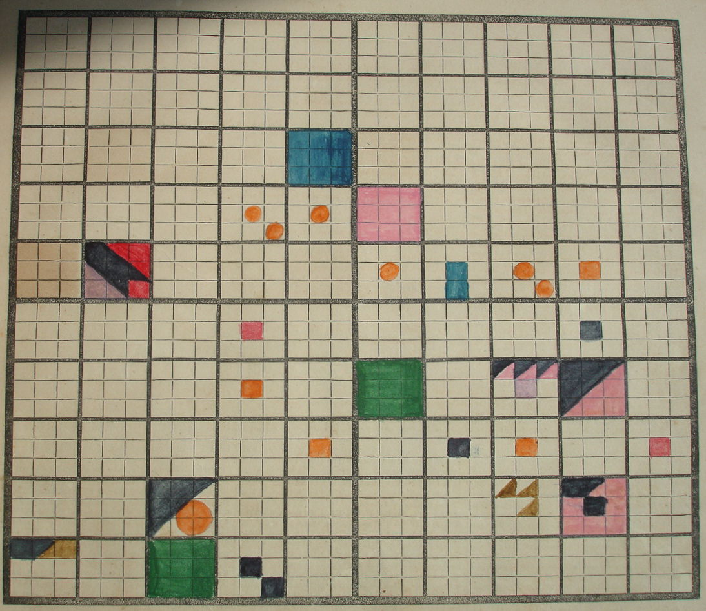

# Dati

<small>Un grafico compilato dalla Storia universale di Elizabeth Peabody (1859) - [Fonte](https://beinecke.library.yale.edu/article/visualizing-history)</small>

### 1. I dati sono tutto ciò che riusciamo a rilevare.
#### 1.2. I dati sono la rappresentazione elementare della realtà.
#### 1.3. La rilevazione dei dati è un bisogno.
#### 1.4. Accumulare dati è un costo di produzione e gestione che richiede una selezione quantitativa e qualitativa.
#### 1.4.1. La selezione è la struttura che, assieme alla sequenza e all’iterazione, controlla la logica della raccolta dei dati.
#### 1.4.2. La quantità dei dati è definita dal bisogno di rilevare un fenomeno.
#### 1.4.3. La qualità dei dati è il valore che attribuiamo alla loro quantità in relazione alla conoscenza di un fenomeno.
#### 1.5. La rilevazione automatica è il bilanciamento tra costi di rilevazione e di gestione.
#### 1.6. Il formato dei dati dipende dalla capacità di gestione.
#### 1.6.1. Il formato digitale dei dati è finalizzato alla gestione automatica attraverso le macchine.
#### 1.6.2. Il formato digitale è soggetto ad obsolescenza se la gestione di un dato non può essere automatizzata.
#### 1.6.2.1. La necessità di automatizzare la gestione e l’accesso ai dati dipende dalla loro frequenza e dalla loro diffusione di utilizzo.
#### 1.6.3. La conservazione di un dato su formato digitale è più costosa rispetto al dato su supporto fisico.
#### 1.6.4. I costi di conservazione digitale sono assorbibili da una gestione automatizzata.
#### 1.6.5. La gestione automatizzata è l’insieme delle regole di archiviazione, catalogazione e progettazione dell’architettura informatica.
#### 1.6.6. I dati in formato digitale richiedono una gestione orientata ai servizi che possono produrre.
#### 1.7. I servizi dei dati digitali sono finalizzati a migliorare lo scambio dei dati e la loro trasformazione in conoscenza.
#### 1.7.1. La conoscenza implicita è l’insieme non codificato con cui le persone costruiscono la propria relazione sull’accesso paritario ai dati.
#### 1.7.1.1. Una comunità è un gruppo di persone che accettano l’accesso paritario ai dati per i propri membri.
#### 1.7.1.2. La conoscenza implicita si sviluppa sulla facilità di accesso ai dati in una comunità. Le relazioni basate sui dati comuni rafforzano la socialità interna di una comunità.
#### 1.7.1.3. La socializzazione è la capacità di produrre informazioni dal riuso dei dati.
#### 1.7.1.4. La conoscenza esplicita nasce dal bisogno di una comunità di trasmettere esternamente le proprie basi dati.
#### 1.7.2. La conoscenza esplicita di una comunità è la capacità di formalizzare le regole e le aspettative verso altre comunità attraverso lo scambio dati.
#### 1.7.2.2. Le comunità che scambiano conoscenza esplicita sono il nucleo di una società che ha interiorizzato le rispettive conoscenza implicite.
#### 1.7.3. La condivisione dati tra comunità avviene finché viene viene prodotto un valore economico e sociale.
#### 1.8. I documenti sono la forma discorsiva dei dati.
