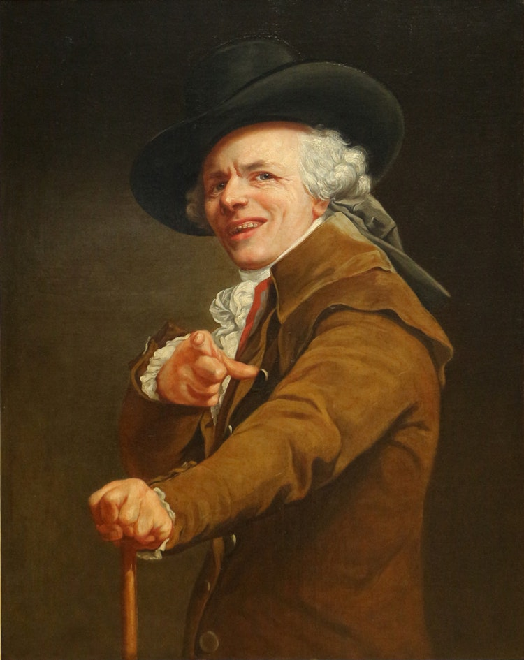

# Linguaggio

<small>[Joseph Ducreux](https://it.wikipedia.org/wiki/Joseph_Ducreux), "Autoritratto dell'artista sotto le spoglie di un beffardo" - [Fonte](https://commons.wikimedia.org/wiki/File:Joseph_ducreux,_autoritratto_dell%27artista_che_prende_il_giro,_1793,_01.jpg)</small>

#### 2
I dati sono cose che acquisiscono senso quando fanno parte del linguaggio

#### 2.1
Un linguaggio chiaro è controllabile dai dati che usa.

#### 2.2
Ciò che non è formalizzabile attraverso un metodo di raccolta e gestione dei dati è un'opinione.

IL METODO PERSUADE PIÙ DEI DATI E DELLA CONOSCENZA

Il tempo dedicato alla formalizzazione del metodo di raccolta e gestione dei dati verrà restituito dalla velocità con cui si otterrà significato dall'analisi dei dati.
