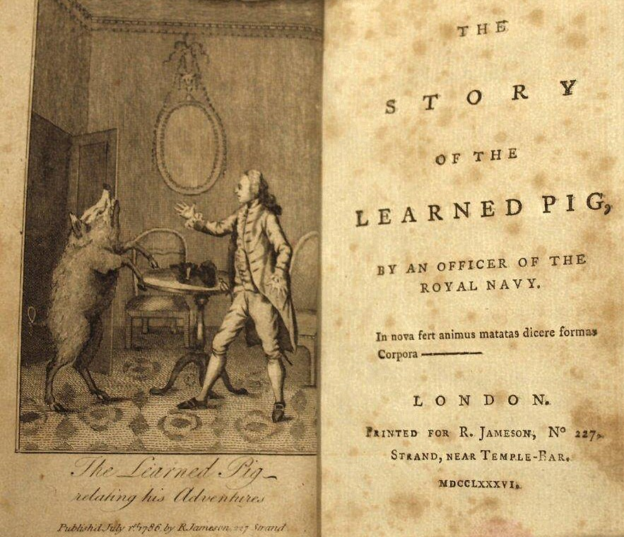

# Conoscenza

<small>The Story of the [Learned Pig](https://en.wikipedia.org/wiki/Learned_pig), By an officer of the Royal Navy (1786) - [Fonte](https://commons.wikimedia.org/wiki/File:Story_of_the_Learned_Pig_by_an_Officer_of_the_Royal_Navy_1786.jpg)</small>

## Il valore della conoscenza sta nella sua storia collettiva

3.x La conoscenza avanza sulla fiducia e sul consenso

5.4 LA CONOSCENZA È UN CAPITALE DISTRIBUITO

LE OPINIONI INFLUENZANO I PREGIUDIZI

I PREGIUDIZI SONO BASATI SU DUE CAPISALDI: PIGRIZIA E ACCESSIBILITÀ

SOCIAL NETWORK E MEME SONO ALLEATI DELLA PERSUASIONE

VUOI KNOWLEDGE WORKER PER TRASFORMARE DATI IN CONOSCENZA?

IL KNOWLEDGE WORKER AGGREGA VALUTA E TRASFORMA I DATI IN PRODOTTI E SERVIZI DI CONOSCENZA

L'ECONOMIA DELLA CONOSCENZA MONETIZZA SULL'ACCESSO AI SERVIZI E PRODOTTI

MAGGIORE È L'ACCESSO AI DATI, MAGGIORE È IL VOLUME DEGLI SCAMBI DI CONOSCENZA

MASSIMIZZARE SULLO SCAMBIO DEI DATI, METTE A RISCHIO IL MERCATO DELLA CONOSCENZA

LE OPINIONI NON DANNO EVIDENZE DI QUANTITÀ E CONFRONTO

LE OPINIONI SONO LO SPECCHIO DELLA VANITÀ

LE OPINIONI NON CREANO CONSENSO MA POPOLARITÀ

LA POPOLARITÀ CREA ANSIA

LA POPOLARITÀ DIVIDE. IL PRESTIGIO PERSUADE
